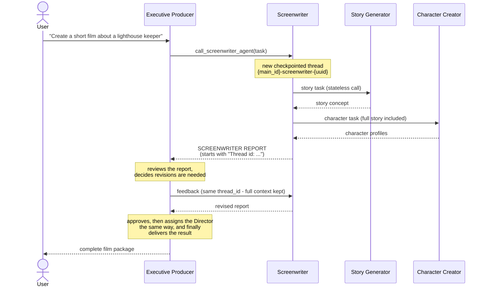

# supervisor-worker_agents

**A hands-on tutorial for building hierarchical multi-agent systems with
LangGraph** - written as a complete, working reference implementation rather
than toy snippets.

The example domain is a movie production studio: a supervisor agent
coordinates worker agents, which in turn use their own specialized
subagents, to take a film idea from concept to a scene-by-scene production
plan. The domain is deliberately simple - the point is the architecture.
Every pattern here transfers directly to other multi-agent problems
(research pipelines, support triage, code review, content generation);
swap the agents and prompts to fit your project's structure and the
orchestration layer stays the same.

## What this tutorial demonstrates

- **Supervisor-worker hierarchy** - one decision-making agent delegates to
  specialist agents through tools, reviews their reports and requests
  revisions, instead of one giant prompt trying to do everything.
- **Persistent, resumable agent conversations** - the coordinating agents
  checkpoint every exchange in Postgres. Each delegation returns a thread id
  the supervisor can pass back to continue that exact conversation, so
  revisions keep full context instead of starting from scratch.
- **Stateless leaf agents where state adds nothing** - the creative
  single-shot agents are plain LLM calls. Knowing what NOT to checkpoint is
  as important as knowing what to checkpoint.
- **Safe parallel tool execution** - parallel tool calls with per-thread
  locks, thread-id validation against fabricated or foreign ids, and
  LLM-recoverable error messages so agents fix their own mistakes mid-run.
- **Prompt engineering as configuration** - every agent's prompt, model,
  temperature and cache key lives in a YAML file, tuned per role: deterministic
  coordinators (temperature 0), creative leaf agents (0.4-0.9).
- **Observability built into state** - every spawned subagent's thread id is
  recorded in checkpointed state, so any run's full delegation tree and
  complete interaction transcript can be reconstructed afterwards from state
  alone (see `visualize` below).

## Agent hierarchy

```
executive_producer            (supervisor, checkpointed conversation)
├── screenwriter              (worker, checkpointed conversation)
│   ├── story_generator       (stateless LLM call)
│   └── character_creator     (stateless LLM call)
└── director                  (worker, checkpointed conversation)
    └── scene_planner         (stateless LLM call)
```

- The **Executive Producer** plans the project, delegates, reviews reports,
  requests revisions and delivers the final result.
- The graph agents (producer, screenwriter, director) persist their
  conversations in Postgres, so every delegation can be resumed by thread id.
- Each agent's prompt, model and temperature live in [llm_config/](llm_config/).

**See it in action without installing anything:** a complete transcript of a
real run - every task, delegation and report between the agents - is
committed at
[logs/visualizations/](logs/visualizations/6c5ae90d789140649e52f5a88bce3976.md).

## One delegation round-trip

How a request flows down the hierarchy and back up, and how a revision
resumes the exact same conversation by thread id:



The same loop repeats for the Director and its Scene Planner. Every solid
arrow into an agent is a tool call carrying the full task; every dashed
arrow back is a report the supervisor reviews before deciding what happens
next.

## Requirements

- Python >= 3.13 and [uv](https://docs.astral.sh/uv/)
- A running PostgreSQL database (used for conversation checkpoints)
- A `.env` file in the project root (copy [.env.example](.env.example)) with
  these keys:

```
OPENAI_API_KEY=...
DB_HOST=...
DB_PORT=...
DB_USER=...
DB_PASSWORD=...
DB_NAME=...
```

## Setup

```bash
uv sync
```

## Running the project from main.py

The root [main.py](main.py) is the single entry point for the whole system.

### 1. Run the main agent

```bash
uv run main.py run "Create a short film about a lighthouse keeper"
```

This invokes the Executive Producer, which coordinates the entire hierarchy
and prints the final result. The first line of the output is the run's main
thread id:

```
Thread id: 8f3a1b2c...
Content: <final delivery>
```

To continue the same project (feedback, revisions, follow-ups), pass that
thread id back as the third argument:

```bash
uv run main.py run "Make the ending darker" <main_thread_id>
```

### 2. Visualize the subagent tree of a run

Every graph agent records the thread ids of the subagents it spawned in its
checkpointed state. Given a main thread id, the full delegation tree is
rebuilt from state alone:

```bash
uv run main.py visualize <main_thread_id>
```

```
executive_producer  [thread: <main_thread_id>]  (6 messages)
├── screenwriter  [thread: <main_thread_id>-screenwriter-a2756f47]  (6 messages)
│   ├── story_generator  (stateless, 1 call)
│   └── character_creator  (stateless, 1 call)
└── director  [thread: <main_thread_id>-director-a364f5b5]  (4 messages)
    └── scene_planner  (stateless, 1 call)
```

### 3. Detailed interaction transcript

The same `visualize` command also writes the complete interaction transcript
of the run to a separate file:

```
logs/visualizations/<main_thread_id>.md
```

It contains, untruncated and in delegation order, the full message history
of every checkpointed agent - every task an agent received, every tool call
with its full arguments, every report that came back and every final answer -
so you can read top to bottom exactly how the agents worked together:

```markdown
## executive_producer — thread `<main_thread_id>` (6 messages)

### [1] Task given to executive_producer
Create a short film concept: a lighthouse keeper discovers...

### [2] executive_producer delegates → call_screenwriter_agent
**call_screenwriter_agent**
task: <the full assignment text>
- thread_id: `None`

### [3] Result from call_screenwriter_agent
Thread id: <main_thread_id>-screenwriter-a2756f47
Content: SCREENWRITER REPORT ...

### [6] executive_producer final answer
...
```

Stateless leaf agents (story generator, character creator, scene planner)
have no thread of their own; their exchanges appear inside the parent's
transcript as the tool call + result.

A complete transcript from a real run is committed in this repo:
[logs/visualizations/6c5ae90d…md](logs/visualizations/6c5ae90d789140649e52f5a88bce3976.md).

Running `uv run main.py` with no arguments prints this usage help.

### Programmatic use

Both entry points are plain async functions importable from main.py:

```python
import asyncio
from main import run_main_agent, visualize_subagents

result = asyncio.run(run_main_agent("Create a short film about a lighthouse keeper"))
# result starts with "Thread id: <main_thread_id>"

asyncio.run(visualize_subagents("<main_thread_id>"))
```


## Code tour

Where to look to understand each pattern, in reading order:

1. [resources/executive_producer_agent_resource/main.py](resources/executive_producer_agent_resource/main.py) -
   the supervisor graph: an LLM node and a tool node in a loop, checkpointed
   per thread, with retry policies and parallel tool execution. The
   screenwriter and director graphs are the same shape one level down.
2. [resources/executive_producer_agent_resource/tools/screenwriter_agent_tool.py](resources/executive_producer_agent_resource/tools/screenwriter_agent_tool.py) -
   a delegation tool: how child thread ids are named, how a passed
   `thread_id` is validated against fabricated or foreign ids (returning an
   LLM-recoverable error string instead of raising), and how per-thread
   locks serialize concurrent runs of one conversation.
3. [llm_config/](llm_config/) - prompts as contracts: each YAML defines the
   agent's role, report format, quality bar and revision rules, plus model
   and temperature per role.
4. [resources/utils/subagent_tracking.py](resources/utils/subagent_tracking.py) -
   how every spawned subagent's thread id is folded into checkpointed state
   after each tool round.
5. [resources/utils/subagent_visualization.py](resources/utils/subagent_visualization.py) -
   rebuilding the full delegation tree and the complete interaction
   transcript of any run from state alone.
6. [resources/utils/context_isolation.py](resources/utils/context_isolation.py) -
   why a child graph launched inside a parent's tool call must be severed
   from the inherited runnable context to checkpoint as its own top-level
   conversation.

## Applying this approach to your own project

The movie studio is just the example. The architecture is a template you can
re-shape to match your project's structure:

1. **Identify your hierarchy.** Who decides, who executes? The supervisor
   role fits any workflow where work must be planned, delegated, reviewed
   and revised: a research lead with searcher/summarizer/fact-checker
   workers, a support triager with diagnostic and resolution agents, a code
   reviewer orchestrating linters and security checkers.
2. **Decide what needs memory.** Agents that hold a back-and-forth
   conversation across revisions get a checkpointed graph and a thread id.
   Single-shot transformations stay stateless - cheaper, simpler, no cleanup.
3. **Write prompts as contracts.** Each prompt in [llm_config/](llm_config/)
   defines the agent's role, its report format, its quality bar and its
   revision rules - the supervisor relies on those contracts to coordinate
   without knowing how the work gets done.
4. **Keep the orchestration generic.** The graph code (LLM node, tool node,
   delegation tools, thread tracking, visualization) doesn't know anything
   about movies. Swap the agents and prompts; the machinery comes along
   unchanged.

The depth of the tree is not fixed either - workers can supervise their own
workers, as the screenwriter does here, so the same pattern scales from two
agents to a whole organization of them.

## Project layout

```
main.py                                  entry point: run + visualize
llm_config/                              agent prompts, models, temperatures (YAML)
logs/visualizations/                     interaction transcripts written by `visualize`
resources/
  executive_producer_agent_resource/     supervisor graph + delegation tools
  screenwriter_agent_resource/           worker graph + its leaf tools
  director_agent_resource/               worker graph + its leaf tool
  story_generator_agent_resource/        stateless leaf agent
  character_creator_agent_resource/      stateless leaf agent
  scene_planner_agent_resource/          stateless leaf agent
  utils/                                 state, checkpointing, subagent tracking + visualization
```

## License

[MIT](LICENSE)
